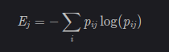

<!-- TODO  -->

# K-Means Clustering

**Part of:** <https://github.com/aayushsingla/ML_Algorithms>  
**Tags: unsupervised ML, clustering**

<!-- TOC -->

-   [K-Means Clustering](#k-means-clustering)
    -   [Introduction](#introduction)
    -   [Evaluating the quality of clusters formed by K-means](#evaluating-the-quality-of-clusters-formed-by-k-means)
    -   [K-Means Algorithm](#k-means-algorithm)
    -   [Data preparation for K-Means Algorithm](#data-preparation-for-k-means-algorithm)
    -   [Implementation of K-Means Algorithm from scratch](#implementation-of-k-means-algorithm-from-scratch)
    -   [Challenges with K-Means Algorithm and K-Means++ algorithm](#challenges-with-k-means-algorithm-and-k-means-algorithm)
    -   [How to choose the right value of K ie. number of clusters?](#how-to-choose-the-right-value-of-k-ie-number-of-clusters)
    -   [Advantages and disadvantages of K-Means](#advantages-and-disadvantages-of-k-means)
    -   [Applications of Clustering in Real-World Scenarios](#applications-of-clustering-in-real-world-scenarios)
    -   [Interview questions](#interview-questions)
    -   [What can we improve here?](#what-can-we-improve-here)
    -   [References](#references)

<!-- /TOC -->

#### Introduction

What truly fascinates me about these recommendation engines is how they group similar items, products, and users together. This grouping, or segmenting, works across industries. And that’s what makes the concept of clustering such an important one in data science.

**Clustering helps us understand our data in a unique way – by grouping things together into – clusters.**

Now clustering can be of different types:

-   **Partition based clustering**: Clustering the data into a given K number of partitions. Example - K-Means Clustering. However, this might not be the best idea in case there don’t exist K clusters in reality but more/less than that. Nevertheless, appropriate K can be figured out using certain metrics.
-   **Hierarchical Clustering**: Unlike Partition based clustering technqiues, HAC techniques are concerned with building a hierarchy of clusters **without imposing a certain number of clusters**. The hierarchy is illustrated using a dendrogram. A dendrogram is a diagram representing a tree and this representation is frequently used in different contexts. In case of HAC, this helps us cut out or select the required number of clusters. Read more about [HAC](https://github.com/aayushsingla/ML_Algorithms/blob/main/machine_learning_algos/hierarchical_agglomerative_clustering_HAC.md) here.
-   **Density-based Clustering**: The above two approaches we have discussed necessarily cluster every data point but there can be some points that need not be clustered. Read more about [density-based clustering](https://github.com/aayushsingla/ML_Algorithms/blob/main/machine_learning_algos/density_based_clustering.md) here.

K-Means Clustering is a non-parametric, non-convex, distance-based algorithm for partition-based clustering. K-Means is also an NP-Hard problem and standard implementations find local optimum solutions. As the name suggests, K-Means Clustering partitions points based on closest mean, so it uses mean as the attribute to associate data points with clusters. There exist other variants like K-Medians Clustering or K-Modes Clustering which use median and mode respectively as association attribute.

Before we go on to discuss K-Means algorithm in detail, we will first discuss what properties we expect our clusters to have and how to evaluate if the clusters finally formed has these properties.

#### Evaluating the quality of clusters formed by K-means

The primary aim of clustering is not just to make clusters, but to make good and meaningful ones. you can divide a space into K regions in infinite ways but we want them in such a way that:

-   All the data points in a cluster should be similar to each other.
-   The data points from different clusters should be as different as possible.

So, now the question is: How can we evaluate the clusters formed by K-Means algorithm?

There are a lot of evaluation metrics which are designed to evaluate K-Means. Some of them are listed below:

-   **Intertia**: Inertia evaluates the first property we discussed above ie. how close the points within the cluster are. Intertia can be easily calculated using these two steps:

    1.  Intracluster distance ie. the sum of square of distances of all the points within a cluster from the centroid of that cluster is calculated for all the clusters.
    2.  These squared distances are summed up to obtain the final inertial value or Inertia.

    Because we want the points within the same cluster to be similar to each other or the distance between them to be as low as possible, we want inertial value to be as small as possible.

-   **Dunn Index**: Dunn Index evaluates both the first and the second properties we discussed above ie. how far the clusters are from each other and how compact they are. Along with the distance between the centroid and points, the Dunn index also takes into account the distance between two clusters.

    **Dunn's indexed is defined as:**  

        Dunn Index = smallest_inter_cluster_distance/largest_intra_cluster_distance

    We want to maximise the Dunn Index to achieve good clusters. The intution behind Dunn's index is pretty simple. We want to maximise inter cluster distance or numerator, hence, increasing the Dunn's index overall. We want to minimise the intracluster distance ie. our largest intracluster distance or denominator should be small, in turn, maximising the Dunn's index. **Thus, higher the Dunn's index, better our clusters will be.**

-   **Entropy**: Entropy is used as an **external validation measure by using the class labels** of data as external information. It is a measure of the purity of the cluster with respect to the given class label. Thus, if each cluster consists of objects with a single class label, the entropy value is 0. As the objects in a cluster become more diverse, the entropy value increases. It is defined as:  
          
    where p\_{ij} is the probability of assigning an object of class i to cluster j, and the sum is taken over all classes.

    **Note:** Using entropy measure to validate the class labels tends to favor k-means which produce clusters in relatively uniform size. This effect is more significant in the situation that the data have highly imbalanced true clusters. **So, using entropy measure for validating k-means clustering can lead to the results being misleading.**

-   **Silhouette Coefficient**: Silhouette Coefficient or silhouette score is another metric used to calculate the goodness of a clustering technique. Its value ranges from -1 to 1. 1 means clusters are well apart from each other and clearly distinguished. 0 means clusters are indifferent, or we can say that the distance between clusters is not significant. -1 means clusters are assigned in the wrong way. The Silhouette Value measures how similar a point is to its own cluster (cohesion) compared to other clusters (separation). It is a function of average intra-cluster distance (a) and average inter-cluster distance (b) and is defined as:

        silhouette score = (b-a)/max(a, b)

     **The intution behind silhouette score is that average distance between a point and other clusters ie. b should be more than the average distance of the point from the points of its clusters ie. a**. A score of 0.7 to 0.8 is considered good for most cases. However, this might vary from dataset to dataset.

Overall, the two most popular metrics evaluation metrics for clustering algorithms are the **Silhouette coefficient and Dunn's Index**.

#### K-Means Algorithm

**Step 1:** Choose the number of clusters K.  
**Step 2:** Select K random points from the data as centroids.  
**Step 3:** Assign all the points to the closest cluster based on squared euclidean distances from centroid.  
**Step 4:** Recompute the centroids of newly formed clusters.  
**Step 5:** Repeat step 3 and 4 until one or all of the following conditions satisfy:   

-   Centroids of newly formed clusters do not change
-   Points remain in the same cluster ie. no change in cluster disribution (Convergence).
-   Maximum number of iterations are reached

**K means algorithm does not optimize distances but squared deviations from the mean. This is also equivalent to minimizing within-cluster variance.**

#### Data preparation for K-Means Algorithm

-   **Data scaling**: Just like data normalization and standardization is important in case of KNN, it is also important for K-Means algorithm. Both KNN and K-Means are distance-based algorithms and having magnitude of one feature higher than other can lead to algorithm becoming biased for that feature.
-   **Missing values**: Because we compute distance between centroid and all the data points, it is really important for us to know all the features of data and even if one single feature is missing, we cannot compute distance with that point. In such cases, it is normal to remove such a value from dataset or use a method like KNN to predict the missing values.
-   **Dimensionality Reduction**: If the number of dimensions increase, a distance-based similarity measure converges to a constant value between any given examples. Hence, use of dimensionality reduction algorithms like PCA, feature selection should be considered.

#### Implementation of K-Means Algorithm from scratch

```python
  import numpy as np

  class K_MEANS:

      def __init__(self, K, iterations=100):
          self.K = K
          self.n_iter = iterations      # total number of iterations
          self.variance_history = []    # array for storing variance vs iterations
                                        # shape -> (n_iterations, 1)

      def calculate_variance(self, cluster):
          # compute squared euclidean distance between
          # centroid and other points return the mean.
          centroid = np.mean(cluster, keepdims=True)
          variance = 0

          for data_point in cluster:
              variance += self.calculate_squared_euclidean_distance(data_point, centroid)

          return variance / len(cluster)

      def calculate_squared_euclidean_distance(self, point, centroid):
          # squared euclidean distance
          return np.sum(np.square(point - centroid))

      def k_means_clustering(self, data, centroids=None, curr_iter=0):

          if curr_iter == self.n_iter:
              return centroids

          if centroids is None:
              # pick any K points as centroids randomly for the first iteration.
              centroids = np.random.choice(data, self.K, replace=False)

          # clusters[i] -> points belonging to that cluster
          clusters = [[] for _ in centroids]

          for d in data:
              # init var
              min_dist_index = -1
              min_dist = float('inf')

              # compute distance of each point from all the centers
              # and find the centroid with minimum distance
              for i, c in enumerate(centroids):
                  dist = self.calculate_squared_euclidean_distance(d, c)
                  if dist < min_dist:
                      min_dist = dist
                      min_dist_index = i

              # Assign the data point to the nearest centroid
              clusters[i].append(d)

          # recompute center/centroid for each cluster.
          recomputed_centroids = []
          for c in clusters:
              recomputed_centroids.append(np.mean(c, keepdims=True))

          # compute mean variance for each cluster
          mean_variance = []
          for c in centroids:
              mean_variance.append(self.calculate_variance(c))

          self.variance_history.append(np.mean(mean_variance))

          return self.k_means_clustering(data, recomputed_centroids, curr_iter + 1)
```

#### Challenges with K-Means Algorithm and K-Means++ algorithm

K-Means algorithm face problems while clustering when the number of points in each cluster differ or when there is a huge density difference between the clusters. See these two images for better visualisation and understanding of the problem: [Image: unequal datapoints in clusters](https://cdn.analyticsvidhya.com/wp-content/uploads/2019/08/Screenshot-from-2019-08-09-13-15-26.png) and [Image: unequal densities in clusters](https://cdn.analyticsvidhya.com/wp-content/uploads/2019/08/Screenshot-from-2019-08-09-13-19-05.png).

One of the solutions to these problems is to use a higher number of clusters. Another issue that might solve this problem is fair initialisation of centroids. Remember how we randomly initialize the centroids in K-Means? Well, this is also potentially problematic because we might get different clusters every time.

To solve this problem of random initialization, we will use an algoirthm called K-Means++ that can be used to choose the initial values, or the initial cluster centroids, for K-Means. The steps to initialize the centroids using K-Means++ are:

**Step 1:** Choose the first cluster randomly from all the datapoints (just the first cluster).  
**Step 2:** Compute the distance of each data point from its nearest cluster center that has been already chosen. When choosing for second cluster, we will only have the first randomly choosen cluster. So all the distances will be computed from this cluster.  
**Step 3:** Choose the farthest point from any of the clusters as the new centroid.  
**Step 4:** Repeat step 2 and 3 until all K clusters are choosen.  

Using K-Means++ to initialize the centroids tends to improve the clusters. Although it is computationally costly relative to random initialization, subsequent K-Means often converge more rapidly. This problem of initialisation in K-means that determines its overall performance is also known as **initialization sensitivity.**

#### How to choose the right value of K ie. number of clusters?

K is the most important hyperparameter for K-Means clustering algorithm and the performance of the algorithm can fairly increase or decreased based on this value. There are many methods to choose K and some of them are listed below:

-   **Elbow method:** This is the method used for choosing K in KNN and same can be applied here. However, instead of plotting error (we can't compute error here due to unavailability of labels) against K, we plot an evaluation metric (like Intertia or Dunn Method or Silhouette Coefficient) against K. From the graph obtained, we try to choose the best K from the trend we obtained. Increase in computation cost is one another factor that is considered while choosing K from the graph (only in cases, when the gain in performance w.r.t K is very less).

#### Advantages and disadvantages of K-Means

**Advantages:**

-   Easy to understand and implement.
-   **Guaranteed convergence**.
-   Computationally efficient for both training and prediction.

**Disadvantages:**  

-   **Depends on K:** Forcefully partitions into K clusters, and so an appropriate K needs to be figured out.
-   **Depends on cluster initializations:** General implementations of K-Means try to converge to local optimum solutions which is why it’s important to run it for a sufficient number of iterations and minimize goodness metrics like Inertia.
-   **Doesn’t capture uncertainty in cluster assignments:** If I run K-Means 100 times, how often would two data points be clustered together. K-Means doesn’t capture this.
-   **Cannot separate non-convex clusters:** K-Means partitions data into convex sets and so is unable to properly cluster non-convex sets. **In Euclidean space, an object is convex if for every pair of points within the object, every point on the straight line segment that joins them is also within the object.** An example of two convex sets is shown in this [image](https://pafnuty.files.wordpress.com/2013/08/banana_shape.png). When we try to use k-means on this example, it doesn’t do very well. There’s just no way to form these two clusters with two little circular paper cut-outs. Or three. This [image](https://pafnuty.files.wordpress.com/2013/08/pure_kmeans.png) shows how the final results look.
-   **Forms spherical clusters**: By the nature of distance metric that is generally chosen i.e. Euclidean distance, clusters formed are spherical in nature. However, it’s not necessary that data points are in that sense and can be in any shape.
-   **Cluster labels aren’t interpretable:** It’s important to note that cluster labels in themselves don’t make sense (so I could have a point clustered in Cluster Label 1 in one iteration and clustered in Label 2 in the next iteration), what makes sense is how often two data points are clustered together. Also, in order to understand what these clusters represent, further exploratory analysis needs to be done.

One can also try running K-Means a number of times and based on cluster labels check how often two data points occur together, and accordingly cluster points. This is one approach to doing **ensemble clustering**.

#### Applications of Clustering in Real-World Scenarios

-   **Customer Segmentation**: One of the most common applications of clustering is customer segmentation to recommend people a product or service.
-   **Document Clustering**: Let’s say you have multiple documents and you need to cluster similar documents together. Clustering helps us group these documents such that similar documents are in the same clusters.
-   **Image Segmentation**: We can also use clustering to perform image segmentation. Here, we try to club similar pixels in the image together. We can apply clustering to create clusters having similar pixels in the same group.
-   **Recommendation Engines**: Clustering can also be used in recommendation engines. Let’s say you want to recommend songs to your friends. You can look at the songs liked by that person and then use clustering to find similar songs and finally recommend the most similar songs.

#### Interview questions

<!-- ----------------------------------------------------------------------------------------------- -->

**Q.** What is space and time complexity of the K-Means Algorithm?  
**A.** **Time complexity:** The standard implementation using Lloyd's algorithm has a time complexity of **O(ndkt)** where **n** is number of samples in dataset, **d** is dimensionality of features, **k** is number of clusters and **t** is number of iterations the trainig needs to be runned for.  
**Space complexity**: O(N)

<!-- ----------------------------------------------------------------------------------------------- -->

**Q.** Compare Hierarchical Clustering and K-Means Clustering?  
**A.**  

-   Hierarchical Clustering is a computationally expensive algorithm compared to K-Means clustering. It has a TC of O(n3d) where as K-means has an TC of O(n.k.d.i). Its memory consumption is quadratic where as K-means has linear memory consumption.
-   **K-Means algorithm is extremely limited in applicability. It is limited to Euclidean distances and generally, gives poor results when used with other algorithms. Also, it only works on numerical data.** However, hierarchical clustering does not even require distances (any measure can be used, including similarity function simply by preferring high values to low values). It can use any type of data including categorical, strings, time series, or mixed.
-   K-Means fixes number of clusters before it starts to work whereas, HAC doesnot need it.

<!-- ----------------------------------------------------------------------------------------------- -->

**Q.** Explain some cases where k-Means clustering fails to give good results?  
**A.**  

-   K-means has trouble clustering data where clusters are of **various sizes and densities**.
-   **Outliers** will cause the centroids to be dragged, or the outliers might get their own cluster instead of being ignored. Outliers should be clipped or removed before clustering.
-   If the number of **dimensions increase**, a distance-based similarity measure converges to a constant value between any given examples. Dimensions should be reduced before clustering them.

<!-- ----------------------------------------------------------------------------------------------- -->

**Q. Why does K-means clustering algorithm use only Euclidean distance metric?**
**A.** K-means minimizes within-cluster variance. Now if you look at the definition of variance, it is identical to the sum of squared Euclidean distances from the center. The basic idea of k-means is to minimize squared error. It does not optimize distances but squared deviations from the mean. There is no "distance" involved here.

<!-- ----------------------------------------------------------------------------------------------- -->

**Q.** What is the difference between K-Means and K-Medians and when would you use one over another?  
**A.** **K-Means minimizes within-cluster variance**, which equals squared Euclidean distances. In general, the arithmetic mean does this. **It does not optimize distances but squared deviations from the mean**. **K-Medians minimizes absolute deviations**, which equals Manhattan distance. In general, the per-axis median should do this. It is a good estimator for the mean if you want to minimize the sum of absolute deviations (that is sum_i abs(x_i-y_i)), instead of the squared ones.

To decide between k-means and k-medians, take into consideration the following:
- If the distance is squared Euclidean distance, use k-means.
- If the distance is Taxicab metric, use k-medians.
- If there is any other distance, use **k-medoids**.

There is an exception which is:
Maximizing cosine similarity is related to minimizing the squared Euclidean distance on the L2-normalized data. So, if the data is L2 normalized, and it is L2-normalized each iteration, then k-means can be used.

L2 normalization can be useful when you want to force learned embeddings to lie on a sphere or something like that, but I'm not sure this function is intended for use in a data preprocessing scenario like you describe.

<!-- ----------------------------------------------------------------------------------------------- -->

**Q.** How would you perform k-Means on very large datasets?  
**A.** If the dataset is large, an alternative is using **Mini-batch K-Means**. Mini batch k-means has the main advantage of reducing the computational cost of finding a partition. This cost is proportional to the size of the sample batch used and this difference is more evident when the number of clusters is larger. **The main idea of mini-batch k-Means is to use small random batches of data of a fixed size, so they can be stored in memory. Each iteration a new random sample from the dataset is obtained and used to update the clusters and this is repeated until convergence.**

<!-- ----------------------------------------------------------------------------------------------- -->

**Q.** Why K-Means doesnot work well with convex clusters? How can we fix it?  
**A.** The K-means algorithm, in its basic form, is like making little circular paper cutouts in 2D space (because it uses euclidean distance metric) and using them to cover the data points. We can change the quantity and size and position of our paper cut-outs, but they are still round and, thus, these non-convex shapes evade us. In Euclidean space, an object is convex if for every pair of points within the object, every point on the straight line segment that joins them is also within the object. **By combining k-means with another algorithm, hierarchical clustering, we can solve this problem of non-convex sets.** First, we cluster the data into a large number of clusters using k-means. Then, we take these many clusters from k-means and then start clustering them together into bigger clusters using a single-link agglomerative method. Here is how final results look like: [Results](https://pafnuty.files.wordpress.com/2013/08/clustering_animation_01.gif?w=830)

<!-- ----------------------------------------------------------------------------------------------- -->

<!-- [Improve] -->

#### What can we improve here?

-   Add more deatils on clustering evaluation metrics/explain existing ones.
-   Try to discuss imbalanced dataset through out the article.
-   Rewrite entropy part in evaluation metrics.
-   K-medoids
-   K-means using cosine similarity
-   Improve the answer to K-means vs K-medians in interview questions.

#### References

1.  [Rajat Gupta ML Notes](https://ml-notes-rajatgupta.notion.site/)
2.  [Analytics Vidhya - comprehensive guide K means clustering](https://www.analyticsvidhya.com/blog/2019/08/comprehensive-guide-k-means-clustering/)
3.  [Silhouette Coefficient](https://towardsdatascience.com/silhouette-coefficient-validating-clustering-techniques-e976bb81d10c)
4.  [ML stack cafe - K means clustering interview questions](https://www.mlstack.cafe/blog/k-means-clustering-interview-questions)
5.  [pafnuty.blog](https://pafnuty.wordpress.com/2013/08/14/non-convex-sets-with-k-means-and-hierarchical-clustering/)
